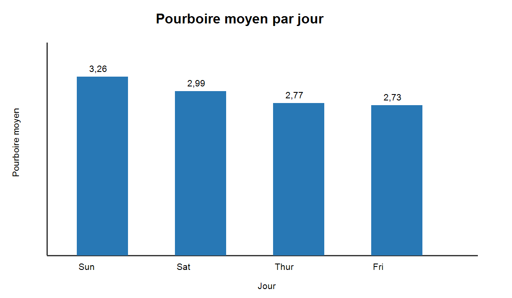

# Python Data Analyst

Portfolio pédagogique de data analyse moderne avec Python. Le projet transforme
des exercices historiques en parcours court, reproductible et testé : chargement,
qualité, nettoyage, agrégation, visualisation et extraction HTML.

## Objectifs et compétences

- manipuler des données avec Pandas et NumPy ;
- construire des transformations lisibles sans mutation implicite ;
- présenter une analyse avec Matplotlib et Seaborn ;
- rendre les traitements réutilisables et testables ;
- appliquer une démarche qualité avec Ruff, Black, Pytest et GitHub Actions.

Technologies : Python 3.12, Pandas 2.2+, NumPy 2+, Matplotlib 3.9+,
Beautiful Soup 4 et JupyterLab 4.

## Organisation

```text
data/raw/          jeux de données sources légers
data/processed/    sorties reproductibles
notebooks/         parcours pédagogique numéroté
src/               chargement, nettoyage, analyse et visualisation
tests/             tests unitaires hors ligne
images/            visuels destinés au portfolio
reports/           audit, renommages et checklist
```

## Installation sous Windows

Prérequis : Git et Python 3.12.

```powershell
git clone https://github.com/ShaD971/Python_Data_Analyst.git
cd Python_Data_Analyst
python -m venv .venv
.\.venv\Scripts\Activate.ps1
python -m pip install --upgrade pip
pip install -r requirements-dev.txt
jupyter lab
```

## Parcours des notebooks

1. `01_pandas_fondamentaux.ipynb` : chargement, typage et statistiques.
2. `02_nettoyage_donnees.ipynb` : colonnes, doublons et valeurs manquantes.
3. `03_transformation_agregation.ipynb` : indicateurs par catégorie.
4. `04_visualisation_matplotlib.ipynb` : comparaison des pourboires moyens.
5. `05_web_scraping.ipynb` : extraction HTML locale, sans dépendance réseau.

Les exemples analysent la structure du jeu Iris, la qualité des données et les
pourboires moyens par jour. Ces résultats sont pédagogiques et ne constituent pas
des conclusions généralisables à une population réelle.



## Qualité et reproductibilité

```powershell
ruff check .
black --check .
python -m pytest -v
jupyter nbconvert --to notebook --execute notebooks\01_pandas_fondamentaux.ipynb --output executed_01.ipynb
```

Le workflow GitHub Actions exécute les trois contrôles de code sous Python 3.12.
Les notebooks ont été nettoyés de leurs sorties pour limiter la taille du dépôt.

## Limites et évolutions

La provenance primaire de certains jeux historiques n'était pas documentée ; seuls
trois fichiers légers sont conservés. L'exemple de scraping est volontairement
hors ligne. Les prochaines améliorations possibles sont une analyse métier plus
approfondie, une couverture de tests accrue et la documentation des licences des
sources avant l'ajout de nouvelles données.

## Auteur

Kevin Toleon<br>
Ingénieur en développement<br>
Data Analysis · Python · Pandas · Power BI

## Licence

Ce projet est distribué sous licence MIT.
